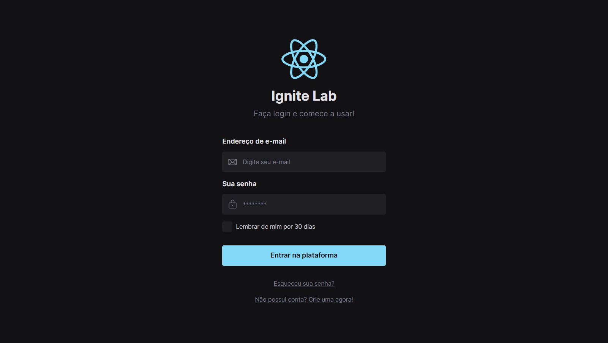

<h1 align="center">
  
</h1>

<h4 align="center"> 
  Ignite Lab #04 - Design System
</h4>

  
  
  
  
  
  

## Índice

* [Índice](#índice)
* [Sobre](#sobre)
  * [Tecnologias](#principais-tecnologias-utilizadas)
* [Licença](#licença)

## Sobre

O projeto foi desenvolvido na quarta edição do evento Ignite Lab, edição também chamada de Ignite Lab Design System, proporcionado pela empresa [Rocketseat](https://rocketseat.com.br/) ao público geral.

O propósito do projeto foi desenvolver um Design System utilizando React, Storyboard e Figma.

### Principais tecnologias utilizadas

O sistema foi desenvolvido em TypeScript. Dentre as tecnologias utilizadas, destaco:

- [Vite](https://vitejs.dev/)
- [React](https://react.dev/)
- [Tailwind CSS](https://tailwindcss.com/)
- [Radix UI](https://www.radix-ui.com/)
- [Storybook](https://storybook.js.org/)

## Licença

Este projeto está sob a licença MIT. Para maiores detalhes acesse o <a href="./LICENSE.md">arquivo de licença</a>.
