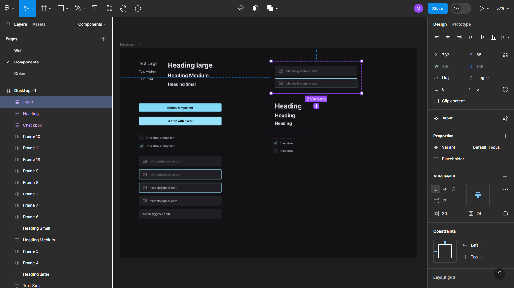
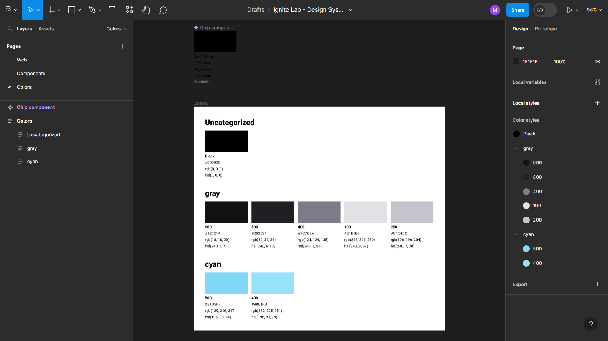
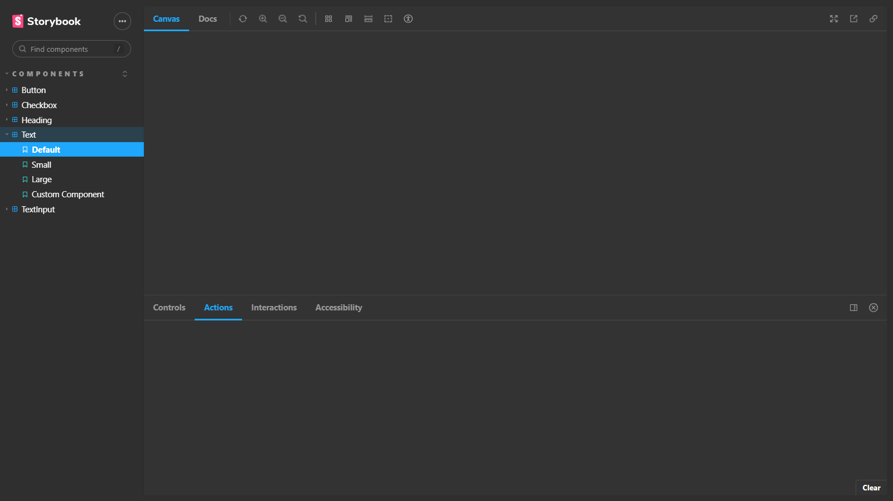

<h1 align="center">
  
</h1>

<h4 align="center"> 
  Ignite Lab #04 - Design System
</h4>

  
  
  
  
  
  

## Índice

* [Índice](#índice)
* [Sobre](#sobre)
  * [Conceito](#conceito)
  * [Tecnologias](#principais-tecnologias-utilizadas)
* [Instalação local](#instalação-local)
* [Licença](#licença)

## Sobre

O projeto foi desenvolvido na quarta edição do evento Ignite Lab, edição também chamada de Ignite Lab Design System, proporcionado pela empresa [Rocketseat](https://rocketseat.com.br/) ao público geral.

### Conceito

O propósito do projeto foi desenvolver um Design System e colocá-lo em prática. Isso foi composto em 3 partes:

- Prototipação dos componentes no [Figma](https://www.figma.com/file/6rqoN3J8EgZZJESOxK7qOJ/Ignite-Lab---Design-System?type=design&node-id=1%3A3&mode=design&t=hB1EVZ31xjJCegdZ-1)
- Aplicação Web de desenvolvimento e uso dos componentes
- [Aplicação Web Storybook](https://marcel099.github.io/rs-ignite-lab-04-design-system) para documentação de componentes

  
  
  

### Principais tecnologias utilizadas

A aplicação foi desenvolvido em TypeScript. Dentre as tecnologias utilizadas, destaco:

- [Vite](https://vitejs.dev/)
- [React](https://react.dev/)
- [Tailwind CSS](https://tailwindcss.com/)
- [Radix UI](https://www.radix-ui.com/)
- [Storybook](https://storybook.js.org/)

## Instalação local

Passos para atingir isso podem ser conferidos <a href="./INSTALLATION.md">neste arquivo</a>.

## Licença

Este projeto está sob a licença MIT. Para maiores detalhes acesse o <a href="./LICENSE.md">arquivo de licença</a>.
